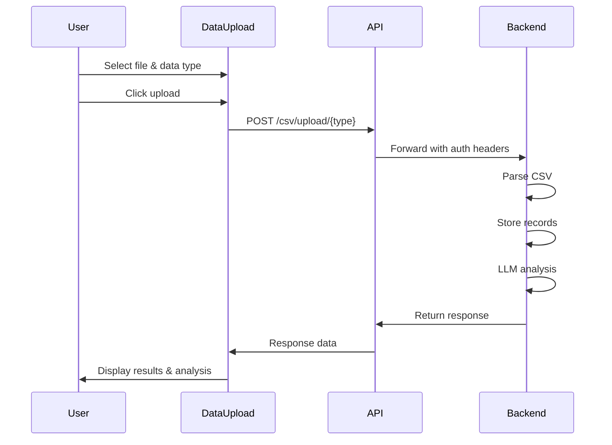

# Design Document: CSV Upload Frontend Redesign

## Overview

This design refactors the DataUpload.jsx component to properly integrate with the existing backend CSV upload API endpoints. The backend provides AI-powered analysis through the LLM reasoning engine for products, reviews, and sales data. The current implementation uses incorrect endpoints that don't exist, resulting in failed uploads.

The redesign focuses exclusively on frontend changes to DataUpload.jsx, updating API calls to use the correct /csv/upload/* endpoints and displaying the AI analysis results returned by the backend. No backend modifications are required.

### Key Changes

1. Update API endpoint calls from /ingestion/upload/* and /amazon/upload to /csv/upload/products, /csv/upload/reviews, /csv/upload/sales
2. Add sales data type support with dedicated endpoint
3. Display AI analysis results (intent, confidence, agents_used, report, token_usage)
4. Remove legacy features (dataFormat selector, JSON support, job polling, insights dashboard)
5. Update CSV format examples to match backend expectations
6. Preserve existing UI/UX design and drag-and-drop functionality

### Design Principles

- Frontend-only changes - no backend modifications
- Maintain existing UI/UX patterns and styling
- Remove unused code and legacy features
- Display rich AI analysis results from backend
- Provide clear CSV format guidance to users

## Architecture

### Component Structure

The DataUpload component follows a single-file React component architecture with the following responsibilities:

```
DataUpload.jsx
├── State Management (useState hooks)
│   ├── selectedFile - uploaded file reference
│   ├── dataType - selected data type (products/reviews/sales)
│   ├── uploading - upload in progress flag
│   ├── uploadResult - backend response data
│   └── error - error message display
├── File Handling
│   ├── handleFileSelect - file input change handler
│   ├── handleDragOver - drag event handler
│   └── handleDrop - drop event handler
├── API Integration
│   └── handleUpload - POST to /csv/upload/{dataType}
└── UI Rendering
    ├── Upload Section (file selector, data type radio buttons)
    ├── Results Section (upload counts, AI analysis display)
    └── Instructions Section (CSV format examples)
```

### API Integration Pattern

The component uses axios for HTTP requests with the following pattern:

```javascript
// Endpoint selection based on data type
const endpoint = `/csv/upload/${dataType}` // products, reviews, or sales

// FormData construction
const formData = new FormData()
formData.append('file', selectedFile)

// POST request with multipart/form-data
const response = await api.post(endpoint, formData, {
  headers: { 'Content-Type': 'multipart/form-data' }
})
```

The axios instance (imported from '../utils/axios') handles:
- Base URL configuration
- Authentication headers (Authorization: Bearer token)
- Request/response interceptors
- Error handling

### Response Flow



## Components and Interfaces

### State Variables

```javascript
// File selection
const [selectedFile, setSelectedFile] = useState(null)

// Data type selection (products, reviews, sales)
const [dataType, setDataType] = useState('products')

// Upload status
const [uploading, setUploading] = useState(false)

// Backend response
const [uploadResult, setUploadResult] = useState(null)

// Error handling
const [error, setError] = useState(null)
```

### API Response Interface

Based on the backend implementation, the response structure for each endpoint:

**Products Upload Response:**
```typescript
{
  status: 'success',
  products_uploaded: number,
  analysis: {
    intent: string,
    confidence: number,
    agents_used: string[],
    report: string
  },
  token_usage: {
    prompt_tokens: number,
    completion_tokens: number,
    total_tokens: number
  }
}
```

**Reviews Upload Response:**
```typescript
{
  status: 'success',
  reviews_uploaded: number,
  analysis: {
    intent: string,
    confidence: number,
    agents_used: string[],
    average_rating: number,
    report: string
  },
  token_usage: {
    prompt_tokens: number,
    completion_tokens: number,
    total_tokens: number
  }
}
```

**Sales Upload Response:**
```typescript
{
  status: 'success',
  sales_records_uploaded: number,
  analysis: {
    intent: string,
    confidence: number,
    agents_used: string[],
    total_revenue: number,
    total_quantity: number,
    report: string
  },
  token_usage: {
    prompt_tokens: number,
    completion_tokens: number,
    total_tokens: number
  }
}
```

### Event Handlers

**File Selection:**
```javascript
const handleFileSelect = (event) => {
  const file = event.target.files[0]
  if (file && file.name.endsWith('.csv')) {
    setSelectedFile(file)
    setError(null)
    setUploadResult(null)
  } else {
    setError('Please select a CSV file')
    setSelectedFile(null)
  }
}
```

**Upload Handler:**
```javascript
const handleUpload = async () => {
  if (!selectedFile) {
    setError('Please select a file first')
    return
  }

  setUploading(true)
  setError(null)
  setUploadResult(null)

  try {
    const formData = new FormData()
    formData.append('file', selectedFile)
    
    const endpoint = `/csv/upload/${dataType}`
    
    const response = await api.post(endpoint, formData, {
      headers: { 'Content-Type': 'multipart/form-data' }
    })

    setUploadResult(response.data)
  } catch (err) {
    setError(err.response?.data?.detail || err.message || 'Upload failed')
  } finally {
    setUploading(false)
  }
}
```

## Data Models

### CSV Format Specifications

**Products CSV:**
```csv
sku,name,category,price,currency,marketplace,inventory_level
PROD-001,Wireless Mouse,Electronics,29.99,USD,Amazon,150
PROD-002,USB Cable,Electronics,9.99,USD,eBay,300
PROD-003,Laptop Stand,Office,49.99,USD,Amazon,75
```

Required columns:
- sku (string): Unique product identifier
- name (string): Product name
- category (string): Product category
- price (float): Product price
- currency (string): Currency code (default: USD)
- marketplace (string): Sales channel
- inventory_level (integer): Current stock quantity

**Reviews CSV:**
```csv
product_id,rating,text,source
550e8400-e29b-41d4-a716-446655440000,5,Great product! Highly recommend.,Amazon
550e8400-e29b-41d4-a716-446655440000,4,Good quality but shipping was slow.,eBay
550e8400-e29b-41d4-a716-446655440001,3,Average product. Works as expected.,Amazon
```

Required columns:
- product_id (UUID): Product identifier (must exist in products table)
- rating (integer): Rating from 1-5
- text (string): Review text content
- source (string): Review source/platform

**Sales CSV:**
```csv
product_id,quantity,revenue,date,marketplace
550e8400-e29b-41d4-a716-446655440000,10,299.90,2024-01-15,Amazon
550e8400-e29b-41d4-a716-446655440000,5,149.95,2024-01-16,eBay
550e8400-e29b-41d4-a716-446655440001,3,149.97,2024-01-17,Amazon
```

Required columns:
- product_id (UUID): Product identifier (must exist in products table)
- quantity (integer): Units sold
- revenue (float): Total revenue from sale
- date (ISO date): Sale date (YYYY-MM-DD format)
- marketplace (string): Sales channel

### UI Display Models

**Upload Result Display:**
- Success message with status
- Upload count (products_uploaded, reviews_uploaded, or sales_records_uploaded)
- Additional metrics (average_rating for reviews, total_revenue/total_quantity for sales)

**AI Analysis Display:**
- Intent: What the LLM understood about the data
- Confidence: LLM confidence score (0-1)
- Agents Used: List of AI agents that analyzed the data
- Report: Detailed analysis text with insights and recommendations
- Token Usage: LLM token consumption statistics

## Correctness Properties

*A property is a characteristic or behavior that should hold true across all valid executions of a system-essentially, a formal statement about what the system should do. Properties serve as the bridge between human-readable specifications and machine-verifiable correctness guarantees.*


### Property 1: Data Type to Endpoint Mapping

*For any* data type selection (products, reviews, or sales), the upload handler should construct the API endpoint as `/csv/upload/${dataType}`

**Validates: Requirements 1.1, 1.2, 1.3, 7.2**

### Property 2: Analysis Fields Display

*For any* successful upload response containing analysis data, the component should display all analysis fields: intent, confidence, agents_used, and report

**Validates: Requirements 2.1, 2.2, 2.3, 2.4**

### Property 3: Token Usage Display

*For any* successful upload response containing token_usage data, the component should display the token usage statistics

**Validates: Requirements 2.5**

### Property 4: Format Example Updates

*For any* data type selection change, the visible CSV format example should update to match the selected data type

**Validates: Requirements 3.4**

### Property 5: Upload Count Display

*For any* successful upload response, the component should display the appropriate upload count field (products_uploaded, reviews_uploaded, or sales_records_uploaded) based on the data type

**Validates: Requirements 4.1, 4.2, 4.3**

### Property 6: Success Message Display

*For any* successful upload response with status 'success', the component should display a success message

**Validates: Requirements 4.4**

### Property 7: File Type Validation

*For any* file selection where the filename does not end with '.csv', the component should display a validation error and not set the selected file

**Validates: Requirements 5.5**

### Property 8: Sales Metrics Display

*For any* successful sales upload response, the component should display both total_revenue and total_quantity from the analysis data

**Validates: Requirements 7.4, 7.5**

### Property 9: Drag and Drop Functionality

*For any* valid CSV file dropped onto the upload zone, the component should set that file as the selected file

**Validates: Requirements 8.1**

### Property 10: Upload Button Loading State

*For any* upload operation in progress, the upload button should display a loading state with disabled interaction

**Validates: Requirements 8.3**

### Example Test Cases

The following specific examples should be verified through unit tests:

**Example 1: Products Endpoint**
- Given dataType is 'products'
- When handleUpload is called
- Then API should be called with '/csv/upload/products'

**Validates: Requirements 1.1**

**Example 2: Reviews Endpoint**
- Given dataType is 'reviews'
- When handleUpload is called
- Then API should be called with '/csv/upload/reviews'

**Validates: Requirements 1.2**

**Example 3: Sales Endpoint**
- Given dataType is 'sales'
- When handleUpload is called
- Then API should be called with '/csv/upload/sales'

**Validates: Requirements 1.3**

**Example 4: Amazon Format Removed**
- When component is rendered
- Then no 'Amazon Dataset' radio option should exist

**Validates: Requirements 1.6**

**Example 5: Products Format Example**
- When component is rendered
- Then products format example should include columns: sku, name, category, price, currency, marketplace, inventory_level

**Validates: Requirements 3.1**

**Example 6: Reviews Format Example**
- When component is rendered
- Then reviews format example should include columns: product_id, rating, text, source

**Validates: Requirements 3.2**

**Example 7: Sales Format Example**
- When component is rendered
- Then sales format example should include columns: product_id, quantity, revenue, date, marketplace

**Validates: Requirements 3.3**

**Example 8: Legacy Fields Removed**
- When upload result is displayed
- Then job_id, records_processed, records_validated, and records_rejected should not appear

**Validates: Requirements 4.5**

**Example 9: 400 Error Handling**
- Given backend returns 400 error with detail message
- When upload fails
- Then error detail message should be displayed

**Validates: Requirements 5.1**

**Example 10: 401 Error Handling**
- Given backend returns 401 error
- When upload fails
- Then authentication error message should be displayed

**Validates: Requirements 5.2**

**Example 11: 500 Error Handling**
- Given backend returns 500 error
- When upload fails
- Then server error message should be displayed

**Validates: Requirements 5.3**

**Example 12: Network Error Handling**
- Given network error occurs
- When upload fails
- Then connection error message should be displayed

**Validates: Requirements 5.4**

**Example 13: Data Format Selector Removed**
- When component is rendered
- Then dataFormat state and related UI controls should not exist

**Validates: Requirements 6.1**

**Example 14: JSON Upload Rejected**
- Given a file with .json extension is selected
- When file selection occurs
- Then validation error should be displayed

**Validates: Requirements 6.5**

**Example 15: Dashboard Stats Removed**
- When component is rendered
- Then analysisResult dashboard stats (total_products, active_products, total_reviews, avg_confidence, total_queries) should not appear

**Validates: Requirements 6.6**

**Example 16: Insights UI Removed**
- When component is rendered
- Then expandable insights UI should not appear

**Validates: Requirements 6.7**

**Example 17: Sales Radio Option**
- When component is rendered
- Then sales radio option should exist in data type selector

**Validates: Requirements 7.1**

**Example 18: Sales Format Display**
- Given dataType is 'sales'
- When component is rendered
- Then sales CSV format example should be displayed

**Validates: Requirements 7.3**

**Example 19: File Selection Button**
- When component is rendered
- Then file input button should exist and be clickable

**Validates: Requirements 8.2**

**Example 20: CSS Class Names Preserved**
- When component is rendered
- Then existing CSS class names (upload-dropzone, upload-btn, card, etc.) should be present

**Validates: Requirements 8.5**

## Error Handling

### Client-Side Validation

**File Type Validation:**
- Check file extension before upload
- Only accept .csv files
- Display clear error message for invalid file types
- Reset selectedFile state on validation failure

```javascript
if (file && file.name.endsWith('.csv')) {
  setSelectedFile(file)
  setError(null)
} else {
  setError('Please select a CSV file')
  setSelectedFile(null)
}
```

**Pre-Upload Validation:**
- Verify file is selected before allowing upload
- Disable upload button when no file is selected
- Clear previous results when new file is selected

### Backend Error Handling

**HTTP Error Responses:**

The component handles errors from the axios response:

```javascript
catch (err) {
  setError(err.response?.data?.detail || err.message || 'Upload failed')
}
```

**Error Types:**

1. **400 Bad Request**: Invalid CSV format or missing required columns
   - Display: Backend error detail message
   - Example: "Missing required column: sku"

2. **401 Unauthorized**: Authentication token missing or invalid
   - Display: "Authentication error - please log in again"
   - Action: User should re-authenticate

3. **500 Internal Server Error**: Backend processing failure
   - Display: "Server error - please try again later"
   - Action: User should retry or contact support

4. **Network Error**: Connection failure or timeout
   - Display: "Connection error - please check your network"
   - Action: User should check connection and retry

### Error Display

Errors are displayed in a prominent error message component:

```jsx
{error && (
  <div className="message error-message">
    <AlertCircle size={20} />
    <span>{error}</span>
  </div>
)}
```

### Error Recovery

- Clear error state when new file is selected
- Clear error state when upload is retried
- Preserve file selection after error (allow retry without re-selecting)
- Reset uploading state in finally block to ensure UI returns to normal

## Testing Strategy

### Unit Testing Approach

The testing strategy uses a dual approach combining unit tests for specific examples and property-based tests for universal behaviors.

**Testing Framework:**
- Jest for test runner and assertions
- React Testing Library for component rendering and interaction
- Mock Service Worker (MSW) or jest.mock for API mocking

**Test Organization:**
```
frontend/src/pages/__tests__/
└── DataUpload.test.jsx
```

### Unit Tests

Unit tests verify specific examples, edge cases, and error conditions:

**File Selection Tests:**
- Valid CSV file selection
- Invalid file type rejection (JSON, TXT, etc.)
- Drag and drop functionality
- File input button click

**Data Type Selection Tests:**
- Products radio button selection
- Reviews radio button selection
- Sales radio button selection
- Format example updates on selection change

**API Integration Tests:**
- Correct endpoint for products upload
- Correct endpoint for reviews upload
- Correct endpoint for sales upload
- FormData construction with file
- Authorization headers included

**Response Display Tests:**
- Products upload count display
- Reviews upload count display
- Sales upload count display
- Analysis fields display (intent, confidence, agents, report)
- Token usage display
- Sales-specific metrics (revenue, quantity)

**Error Handling Tests:**
- 400 error display
- 401 error display
- 500 error display
- Network error display
- File validation error display

**Legacy Feature Removal Tests:**
- Amazon format option not present
- dataFormat state not present
- JSON upload rejected
- Dashboard stats not displayed
- Insights UI not displayed
- Legacy response fields not displayed

### Property-Based Testing

Property-based tests verify universal properties across many generated inputs:

**Property Test Configuration:**
- Library: @fast-check/jest for JavaScript property-based testing
- Minimum iterations: 100 per property test
- Each test references its design document property

**Property Test Examples:**

```javascript
// Property 1: Data Type to Endpoint Mapping
// Feature: csv-upload-frontend-redesign, Property 1: For any data type selection, endpoint should be /csv/upload/${dataType}
test('property: data type maps to correct endpoint', () => {
  fc.assert(
    fc.property(
      fc.constantFrom('products', 'reviews', 'sales'),
      (dataType) => {
        const endpoint = `/csv/upload/${dataType}`
        // Mock API and verify endpoint called
        // Test that handleUpload constructs correct endpoint
        expect(endpoint).toBe(`/csv/upload/${dataType}`)
      }
    ),
    { numRuns: 100 }
  )
})

// Property 2: Analysis Fields Display
// Feature: csv-upload-frontend-redesign, Property 2: For any response with analysis data, all fields should display
test('property: all analysis fields are displayed', () => {
  fc.assert(
    fc.property(
      fc.record({
        status: fc.constant('success'),
        products_uploaded: fc.nat(),
        analysis: fc.record({
          intent: fc.string(),
          confidence: fc.float({ min: 0, max: 1 }),
          agents_used: fc.array(fc.string()),
          report: fc.string()
        }),
        token_usage: fc.record({
          prompt_tokens: fc.nat(),
          completion_tokens: fc.nat(),
          total_tokens: fc.nat()
        })
      }),
      (response) => {
        // Render component with response
        // Verify all analysis fields are in the document
        const { getByText } = render(<DataUpload />)
        // Set uploadResult state to response
        // Assert intent, confidence, agents, report are displayed
      }
    ),
    { numRuns: 100 }
  )
})

// Property 7: File Type Validation
// Feature: csv-upload-frontend-redesign, Property 7: For any non-CSV file, validation error should display
test('property: non-CSV files are rejected', () => {
  fc.assert(
    fc.property(
      fc.string().filter(s => !s.endsWith('.csv')),
      (filename) => {
        const file = new File(['content'], filename, { type: 'text/plain' })
        // Simulate file selection
        // Verify error is displayed and selectedFile is null
      }
    ),
    { numRuns: 100 }
  )
})
```

### Integration Testing

While this design focuses on frontend unit and property tests, integration tests should verify:

- End-to-end upload flow with real backend
- Authentication token handling
- File upload with actual CSV files
- Response parsing and display
- Error scenarios with real backend errors

### Test Coverage Goals

- Line coverage: >90%
- Branch coverage: >85%
- Function coverage: >95%
- Critical paths: 100% (upload flow, error handling, file validation)

### Manual Testing Checklist

Before deployment, manually verify:

1. Upload products CSV and verify analysis display
2. Upload reviews CSV and verify analysis display
3. Upload sales CSV and verify analysis display
4. Drag and drop CSV file
5. Try to upload non-CSV file (should be rejected)
6. Verify format examples for all three data types
7. Test error scenarios (invalid CSV, network error)
8. Verify UI/UX matches existing design
9. Verify no legacy features are visible (Amazon format, insights, dashboard stats)
10. Verify responsive design on mobile/tablet

## Implementation Notes

### Code Removal Checklist

The following code elements must be removed from DataUpload.jsx:

**State Variables:**
- `dataFormat` state and setter
- `analysisResult` state and setter
- `insights` state and setter
- `expandedInsights` state and setter
- `currentPage` state and setter
- `itemsPerPage` state and setter

**Functions:**
- `checkJobStatus(jobId)`
- `getInventoryAnalysis()`
- `getInsights()`
- `toggleInsight(index)`
- `handlePageChange(insightIndex, newPage)`
- `handleItemsPerPageChange(newItemsPerPage)`

**UI Components:**
- Data Format selector (Standard/Amazon radio buttons)
- Analysis grid with dashboard stats (total_products, active_products, etc.)
- Insights section with expandable product details
- Pagination controls for insights
- Legacy insights display

**API Calls:**
- `/ingestion/upload/products`
- `/ingestion/upload/reviews`
- `/ingestion/upload/json`
- `/amazon/upload`
- `/ingestion/status/${jobId}`
- `/dashboard/stats`
- `/insights/generate`

**File Type Support:**
- Remove JSON file acceptance from file input
- Remove JSON file handling in handleFileSelect
- Remove JSON file handling in handleDrop

### New Code Requirements

**State Variables to Add:**
- None (existing state is sufficient after cleanup)

**UI Components to Add:**
- Sales radio option in data type selector
- AI Analysis display section with:
  - Intent display
  - Confidence score display
  - Agents used list
  - Analysis report text area
  - Token usage statistics
- Sales-specific metrics display (total_revenue, total_quantity)
- Updated CSV format examples for all three types

**Updated CSV Format Examples:**

Products example should show:
```csv
sku,name,category,price,currency,marketplace,inventory_level
```

Reviews example should show:
```csv
product_id,rating,text,source
```

Sales example (new) should show:
```csv
product_id,quantity,revenue,date,marketplace
```

### Styling Considerations

- Reuse existing CSS classes from DataUpload.css
- Analysis display should use card-based layout (`.card` class)
- Maintain consistent spacing and typography
- Use existing color scheme for success/error messages
- Ensure responsive design for mobile devices

### Accessibility

- Maintain ARIA labels for file input
- Ensure keyboard navigation works for all interactive elements
- Provide screen reader friendly error messages
- Use semantic HTML for analysis results display
- Maintain focus management during upload process

### Performance

- No performance concerns for this frontend-only change
- File upload uses FormData (efficient for large files)
- No polling or repeated API calls (removed checkJobStatus)
- Single API call per upload operation
- Minimal state updates during upload flow

## Deployment Considerations

### Frontend Deployment

- Only frontend/src/pages/DataUpload.jsx needs to be updated
- No backend changes required
- No database migrations needed
- No API contract changes

### Rollback Plan

If issues are discovered after deployment:
1. Revert DataUpload.jsx to previous version
2. No backend rollback needed (backend is unchanged)
3. No data cleanup needed (backend handles data correctly)

### Testing in Staging

Before production deployment:
1. Deploy to staging environment
2. Test all three upload types (products, reviews, sales)
3. Verify AI analysis displays correctly
4. Test error scenarios
5. Verify no legacy features are visible
6. Test with real CSV files from users

### Monitoring

After deployment, monitor:
- Upload success/failure rates
- API error responses (400, 401, 500)
- User feedback on new analysis display
- Browser console errors
- Performance metrics (upload time, render time)

## Future Enhancements

Potential future improvements (out of scope for this redesign):

1. **Bulk Upload**: Support uploading multiple CSV files at once
2. **Upload History**: Display previous uploads and their analysis results
3. **CSV Validation Preview**: Show CSV preview before upload with validation warnings
4. **Export Analysis**: Allow downloading analysis reports as PDF or text
5. **Custom Analysis Queries**: Let users provide custom questions for LLM analysis
6. **Real-time Progress**: Show upload progress bar for large files
7. **CSV Template Download**: Provide downloadable CSV templates for each data type
8. **Field Mapping**: Allow users to map their CSV columns to expected fields
9. **Batch Operations**: Support uploading related data (products + reviews) together
10. **Analysis Comparison**: Compare analysis results across multiple uploads

