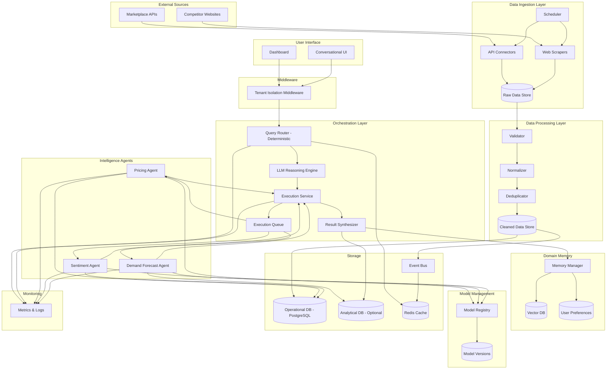
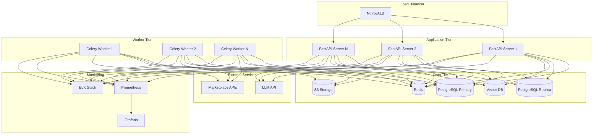
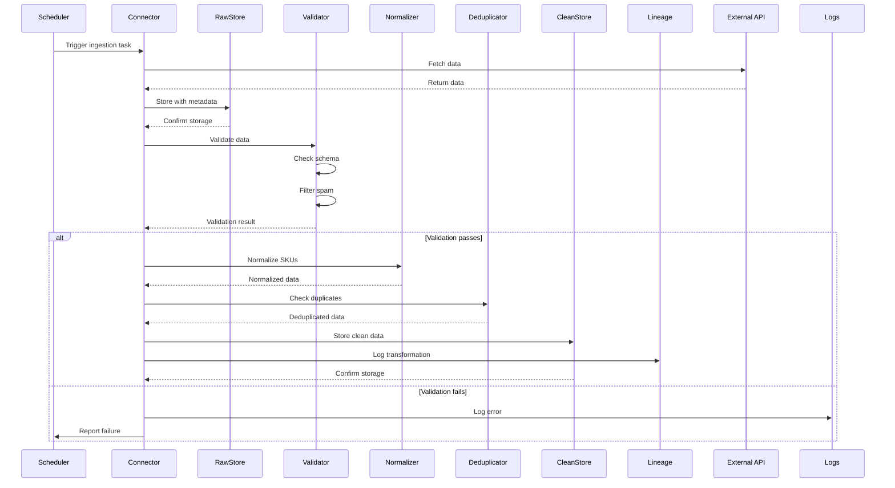
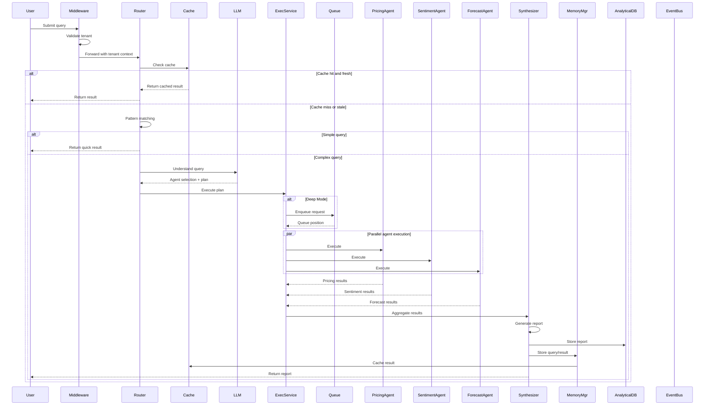
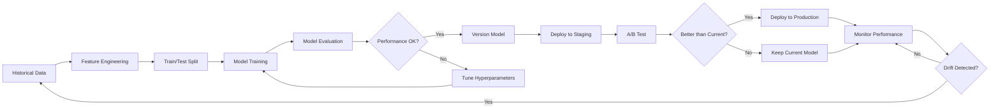

# Design Document: E-commerce Intelligence Research Agent

## Overview

The E-commerce Intelligence Research Agent is a production-grade, multi-agent AI system that provides actionable business intelligence for e-commerce companies. The system follows a layered architecture with clear separation of concerns: data ingestion, processing, specialized intelligence agents, orchestration, and memory management.

The design prioritizes modularity, scalability, and cost-efficiency while maintaining high data quality and transparent confidence scoring. The system supports both Quick Mode (2-minute response) and Deep Mode (10-minute comprehensive analysis) to balance speed and depth.

### Key Design Principles

1. **Modularity**: Each layer and agent operates independently with well-defined interfaces
2. **Observability**: Comprehensive logging, metrics, and tracing throughout
3. **Cost Optimization**: Intelligent caching and prompt optimization to minimize LLM token usage
4. **Data Quality**: Validation, lineage tracking, and confidence scoring at every stage
5. **Scalability**: Horizontal scaling support for all components
6. **Security**: Multi-tenant isolation, encryption, and role-based access control

## Architecture

### System Architecture Diagram



### Architectural Improvements

This design incorporates several key architectural improvements for production readiness:

**1. Separation of Operational and Analytical Data**
- Operational DB (PostgreSQL): Handles transactional data (products, reviews, sales)
- Analytical DB (PostgreSQL/ClickHouse): Stores analysis results, forecasts, aggregated metrics
- Benefits: Prevents analytical queries from impacting operational performance, enables time-series optimization

**2. Memory Manager Pattern**
- Centralized MemoryManager service handles all memory operations
- Prevents direct LLM-to-database writes
- Enforces consistent tenant isolation and access patterns
- Simplifies testing and monitoring

**3. Separation of Routing and Reasoning**
- Query Router: Deterministic pattern matching for common queries (fast, no LLM cost)
- LLM Reasoning Engine: Complex query understanding only when needed
- Benefits: Reduces LLM costs, improves response time for common queries

**4. Execution Service Layer**
- Decouples orchestration from agent execution
- Manages parallelism, dependencies, and resource limits
- Provides single point for execution monitoring and control
- Enables sophisticated execution strategies (retry, fallback, circuit breakers)

**5. Event-Driven Cache Invalidation**
- Data updates publish events to event bus
- Cache subscribers automatically invalidate affected entries
- Benefits: Ensures cache consistency, reduces stale data, decouples components

**6. Explicit Model Registry**
- Central registry for all ML model versions
- Tracks deployment status (development, staging, production)
- Maintains performance history for all versions
- Enables safe model rollouts and rollbacks

**7. Tenant Isolation Middleware**
- Enforces tenant isolation at API boundary
- Validates authorization before any processing
- Injects tenant context into all downstream operations
- Prevents cross-tenant data leakage at the earliest point

**8. Execution Queue for Backpressure**
- Manages Deep Mode request queue
- Prevents system overload during high demand
- Provides wait time estimates to users
- Enables priority-based scheduling

### Layer Responsibilities

**Data Ingestion Layer**
- Scheduled data collection from marketplace APIs and competitor websites
- Rate limiting and retry logic for external API calls
- Raw data storage with source metadata and timestamps
- Error logging and failure notifications

**Data Processing Layer**
- SKU normalization across marketplace formats
- Duplicate detection and removal
- Missing value handling and interpolation
- Data type validation and spam filtering
- Data lineage tracking for audit trails
- Publishes data update events to event bus

**Intelligence Agents**
- Pricing Intelligence: Competitive analysis, gap detection, dynamic pricing
- Sentiment Analysis: Review classification, topic clustering, feature extraction
- Demand Forecasting: Time-series prediction, seasonality detection, inventory alerts
- Read from operational DB, write analytical results to analytical DB
- Register with Model Registry for version tracking

**Orchestration Layer**
- **Query Router**: Deterministic routing based on query patterns and keywords
- **LLM Reasoning Engine**: Complex query understanding and agent selection strategy
- **Execution Service**: Coordinates agent execution, manages parallelism and dependencies
- **Execution Queue**: Manages backpressure for Deep Mode requests
- **Result Synthesizer**: Combines agent outputs into structured reports

**Domain Memory**
- **Memory Manager**: Centralized service for all memory operations
- User preferences and KPI tracking
- Historical query storage
- Business goal contextualization
- Vector embeddings for semantic search
- Prevents direct LLM-to-database writes

**Model Management**
- **Model Registry**: Central registry for all ML model versions
- Version tracking and metadata storage
- Model performance history
- A/B testing configuration
- Deployment status tracking

**Middleware**
- **Tenant Isolation Middleware**: Enforces tenant-level data isolation at API boundary
- Validates tenant authorization on all requests
- Injects tenant context into all downstream operations
- Prevents cross-tenant data leakage

**Event Bus**
- Publishes data update events
- Triggers cache invalidation
- Enables event-driven architecture
- Decouples components

## Components and Interfaces

### 1. Data Ingestion Layer

#### Scheduler Component

```python
class IngestionScheduler:
    """Manages scheduled data collection tasks"""
    
    def schedule_task(
        self,
        source_id: str,
        frequency: timedelta,
        priority: Priority
    ) -> ScheduledTask
    
    def execute_task(self, task_id: str) -> IngestionResult
    
    def handle_failure(
        self,
        task_id: str,
        error: Exception,
        retry_count: int
    ) -> None
```

#### API Connector Component

```python
class MarketplaceConnector:
    """Connects to marketplace APIs for data retrieval"""
    
    def authenticate(self, credentials: APICredentials) -> AuthToken
    
    def fetch_products(
        self,
        marketplace: str,
        filters: Dict[str, Any]
    ) -> List[RawProduct]
    
    def fetch_sales_data(
        self,
        date_range: DateRange
    ) -> List[SalesRecord]
    
    def fetch_inventory(self) -> List[InventoryRecord]
```

#### Web Scraper Component

```python
class CompetitorScraper:
    """Scrapes competitor websites for pricing data"""
    
    def scrape_product_page(
        self,
        url: str,
        selectors: ScraperConfig
    ) -> RawProductData
    
    def respect_rate_limits(self, domain: str) -> bool
    
    def handle_anti_scraping(
        self,
        response: HTTPResponse
    ) -> ScrapingStrategy
```

### 2. Data Processing Layer

#### Validator Component

```python
class DataValidator:
    """Validates incoming data against schemas"""
    
    def validate_schema(
        self,
        data: Dict[str, Any],
        schema: JSONSchema
    ) -> ValidationResult
    
    def validate_data_types(
        self,
        record: DataRecord
    ) -> List[ValidationError]
    
    def filter_spam_reviews(
        self,
        reviews: List[Review]
    ) -> List[Review]
```

#### Normalizer Component

```python
class SKUNormalizer:
    """Normalizes SKU identifiers across marketplaces"""
    
    def normalize_sku(
        self,
        sku: str,
        marketplace: str
    ) -> NormalizedSKU
    
    def map_product_equivalence(
        self,
        product_a: Product,
        product_b: Product
    ) -> EquivalenceMapping
    
    def calculate_mapping_confidence(
        self,
        mapping: EquivalenceMapping
    ) -> float
```

#### Deduplicator Component

```python
class Deduplicator:
    """Removes duplicate records"""
    
    def detect_duplicates(
        self,
        records: List[DataRecord]
    ) -> List[DuplicateGroup]
    
    def resolve_duplicates(
        self,
        group: DuplicateGroup,
        strategy: ResolutionStrategy
    ) -> DataRecord
```

### 3. Intelligence Agents

#### Pricing Intelligence Agent

```python
class PricingIntelligenceAgent:
    """Analyzes competitive pricing and generates recommendations"""
    
    def calculate_price_gaps(
        self,
        our_products: List[Product],
        competitor_products: List[Product],
        mappings: List[EquivalenceMapping]
    ) -> List[PriceGap]
    
    def detect_price_changes(
        self,
        historical_prices: List[PriceHistory],
        threshold: float = 0.05
    ) -> List[PriceChangeAlert]
    
    def extract_promotions(
        self,
        competitor_data: List[CompetitorProduct]
    ) -> List[Promotion]
    
    def suggest_dynamic_pricing(
        self,
        product: Product,
        market_data: MarketData,
        margin_constraints: MarginConstraints
    ) -> PricingRecommendation
    
    def calculate_confidence(
        self,
        recommendation: PricingRecommendation,
        data_quality: DataQualityMetrics
    ) -> float
```

#### Sentiment Analysis Agent

```python
class SentimentAgent:
    """Analyzes customer reviews and feedback"""
    
    def classify_sentiment(
        self,
        review: Review
    ) -> SentimentClassification
    
    def cluster_by_topic(
        self,
        reviews: List[Review],
        num_clusters: int
    ) -> List[TopicCluster]
    
    def extract_features(
        self,
        reviews: List[Review]
    ) -> List[FeatureRequest]
    
    def analyze_complaints(
        self,
        reviews: List[Review]
    ) -> List[ComplaintPattern]
    
    def aspect_sentiment_analysis(
        self,
        review: Review
    ) -> Dict[str, SentimentScore]
```

#### Demand Forecast Agent

```python
class DemandForecastAgent:
    """Forecasts demand and identifies inventory risks"""
    
    def forecast_demand(
        self,
        historical_sales: List[SalesRecord],
        horizon_days: int
    ) -> ForecastResult
    
    def detect_seasonality(
        self,
        time_series: TimeSeries
    ) -> SeasonalityPattern
    
    def identify_demand_supply_gaps(
        self,
        forecast: ForecastResult,
        current_inventory: InventoryLevel
    ) -> List[InventoryAlert]
    
    def calculate_forecast_confidence(
        self,
        forecast: ForecastResult,
        historical_accuracy: float
    ) -> float
```

### 4. Orchestration Layer

#### Tenant Isolation Middleware

```python
class TenantIsolationMiddleware:
    """Enforces tenant-level data isolation at API boundary"""
    
    async def __call__(
        self,
        request: Request,
        call_next: Callable
    ) -> Response:
        """Validate tenant authorization and inject context"""
        
    def extract_tenant_id(self, request: Request) -> UUID
    
    def validate_tenant_authorization(
        self,
        user_id: UUID,
        tenant_id: UUID
    ) -> bool
    
    def inject_tenant_context(
        self,
        request: Request,
        tenant_id: UUID
    ) -> None
```

#### Query Router (Deterministic)

```python
class QueryRouter:
    """Deterministic routing based on query patterns"""
    
    def route_query(
        self,
        query: str,
        context: ConversationContext
    ) -> RoutingDecision
    
    def match_patterns(
        self,
        query: str
    ) -> List[QueryPattern]
    
    def determine_execution_mode(
        self,
        query: str,
        user_preferences: UserPreferences
    ) -> ExecutionMode  # QUICK or DEEP
    
    def check_cache(
        self,
        query_hash: str
    ) -> Optional[CachedResult]
```

#### LLM Reasoning Engine

```python
class LLMReasoningEngine:
    """Complex query understanding using LLM"""
    
    def understand_query(
        self,
        query: str,
        context: ConversationContext
    ) -> QueryUnderstanding
    
    def select_agents(
        self,
        understanding: QueryUnderstanding
    ) -> List[AgentType]
    
    def create_execution_plan(
        self,
        agents: List[AgentType],
        understanding: QueryUnderstanding
    ) -> ExecutionPlan
    
    def track_token_usage(
        self,
        prompt: str,
        response: str
    ) -> TokenUsage
```

#### Execution Service

```python
class ExecutionService:
    """Coordinates agent execution with parallelism and dependencies"""
    
    def execute_plan(
        self,
        plan: ExecutionPlan,
        mode: ExecutionMode
    ) -> List[AgentResult]
    
    def execute_agents_parallel(
        self,
        agents: List[AgentType],
        query: ParsedQuery
    ) -> List[AgentResult]
    
    def handle_agent_failure(
        self,
        agent: AgentType,
        error: Exception
    ) -> FallbackStrategy
    
    def enforce_resource_limits(
        self,
        execution: AgentExecution
    ) -> None
```

#### Execution Queue

```python
class ExecutionQueue:
    """Manages backpressure for Deep Mode requests"""
    
    def enqueue_request(
        self,
        request: QueryRequest,
        priority: Priority
    ) -> QueuePosition
    
    def dequeue_request(self) -> Optional[QueryRequest]
    
    def get_queue_depth(self) -> int
    
    def estimate_wait_time(
        self,
        position: QueuePosition
    ) -> timedelta
```

#### LLM Controller

```python
class QueryRouter:
    """Routes user queries to appropriate agents"""
    
    def parse_query(
        self,
        query: str,
        context: ConversationContext
    ) -> ParsedQuery
    
    def identify_required_agents(
        self,
        parsed_query: ParsedQuery
    ) -> List[AgentType]
    
    def determine_execution_mode(
        self,
        query: ParsedQuery,
        user_preferences: UserPreferences
    ) -> ExecutionMode  # QUICK or DEEP
    
    def check_cache(
        self,
        query_hash: str
    ) -> Optional[CachedResult]
```

#### LLM Controller

```python
class LLMController:
    """Coordinates agent execution using LLM reasoning"""
    
    def orchestrate_agents(
        self,
        agents: List[AgentType],
        query: ParsedQuery,
        mode: ExecutionMode
    ) -> OrchestrationPlan
    
    def execute_plan(
        self,
        plan: OrchestrationPlan
    ) -> List[AgentResult]
    
    def handle_agent_failure(
        self,
        agent: AgentType,
        error: Exception
    ) -> FallbackStrategy
    
    def track_token_usage(
        self,
        prompt: str,
        response: str
    ) -> TokenUsage
```

#### Result Synthesizer

```python
class ResultSynthesizer:
    """Synthesizes multi-agent results into unified reports"""
    
    def synthesize_results(
        self,
        agent_results: List[AgentResult],
        query: ParsedQuery
    ) -> StructuredReport
    
    def generate_executive_summary(
        self,
        report: StructuredReport
    ) -> str
    
    def prioritize_action_items(
        self,
        recommendations: List[Recommendation]
    ) -> List[ActionItem]
    
    def calculate_overall_confidence(
        self,
        agent_confidences: List[float]
    ) -> float
    
    def store_analytical_results(
        self,
        report: StructuredReport,
        analytical_db: AnalyticalDatabase
    ) -> None
```

### 5. Domain Memory

#### Memory Manager

```python
class MemoryManager:
    """Centralized service for all memory operations"""
    
    def store_query_result(
        self,
        query: str,
        result: StructuredReport,
        tenant_id: UUID
    ) -> None
    
    def retrieve_conversation_context(
        self,
        conversation_id: UUID,
        tenant_id: UUID
    ) -> ConversationContext
    
    def store_user_preferences(
        self,
        user_id: UUID,
        preferences: UserPreferences
    ) -> None
    
    def retrieve_user_preferences(
        self,
        user_id: UUID
    ) -> UserPreferences
    
    def search_similar_queries(
        self,
        query: str,
        tenant_id: UUID,
        top_k: int = 5
    ) -> List[HistoricalQuery]
    
    def store_business_context(
        self,
        tenant_id: UUID,
        context: BusinessContext
    ) -> None
```

#### Vector Memory Store

```python
class VectorMemoryStore:
    """Manages semantic search over historical queries and context"""
    
    def store_query_result(
        self,
        query: str,
        result: StructuredReport,
        embedding: np.ndarray
    ) -> None
    
    def retrieve_similar_queries(
        self,
        query_embedding: np.ndarray,
        top_k: int = 5
    ) -> List[HistoricalQuery]
    
    def store_business_context(
        self,
        tenant_id: str,
        context: BusinessContext
    ) -> None
```

#### Preference Manager

```python
class PreferenceManager:
    """Manages user preferences and personalization"""
    
    def store_kpi_preferences(
        self,
        user_id: str,
        kpis: List[KPI]
    ) -> None
    
    def get_marketplace_focus(
        self,
        user_id: str
    ) -> List[str]
    
    def update_business_goals(
        self,
        tenant_id: str,
        goals: List[BusinessGoal]
    ) -> None
```

### 6. Model Management

#### Model Registry

```python
class ModelRegistry:
    """Central registry for all ML model versions"""
    
    def register_model(
        self,
        model_name: str,
        model_version: str,
        model_artifact_path: str,
        metadata: Dict[str, Any]
    ) -> ModelRegistration
    
    def get_active_model(
        self,
        model_name: str
    ) -> ModelVersion
    
    def list_model_versions(
        self,
        model_name: str
    ) -> List[ModelVersion]
    
    def promote_model(
        self,
        model_name: str,
        version: str,
        stage: str  # staging, production
    ) -> None
    
    def record_model_performance(
        self,
        model_name: str,
        version: str,
        metrics: Dict[str, float]
    ) -> None
    
    def get_performance_history(
        self,
        model_name: str,
        version: str
    ) -> List[PerformanceRecord]
```

### 7. Event Bus

#### Event Publisher

```python
class EventPublisher:
    """Publishes domain events for event-driven architecture"""
    
    def publish_data_update_event(
        self,
        entity_type: str,
        entity_id: UUID,
        update_type: str,  # created, updated, deleted
        tenant_id: UUID
    ) -> None
    
    def publish_cache_invalidation_event(
        self,
        cache_keys: List[str],
        reason: str
    ) -> None
    
    def publish_model_update_event(
        self,
        model_name: str,
        old_version: str,
        new_version: str
    ) -> None
```

#### Event Subscriber

```python
class EventSubscriber:
    """Subscribes to domain events and triggers actions"""
    
    def subscribe_to_data_updates(
        self,
        handler: Callable[[DataUpdateEvent], None]
    ) -> None
    
    def subscribe_to_cache_invalidation(
        self,
        handler: Callable[[CacheInvalidationEvent], None]
    ) -> None
    
    def handle_data_update(
        self,
        event: DataUpdateEvent
    ) -> None
```

## Data Models

### Core Data Models

#### Product Model

```python
@dataclass
class Product:
    """Represents a product in the system"""
    id: UUID
    tenant_id: UUID
    sku: str
    normalized_sku: str
    name: str
    category: str
    price: Decimal
    currency: str
    marketplace: str
    inventory_level: int
    created_at: datetime
    updated_at: datetime
    metadata: Dict[str, Any]
```

#### Review Model

```python
@dataclass
class Review:
    """Customer review data"""
    id: UUID
    product_id: UUID
    rating: int  # 1-5
    text: str
    sentiment: Optional[str]  # positive, negative, neutral
    sentiment_confidence: Optional[float]
    aspects: Optional[Dict[str, float]]  # aspect -> sentiment score
    is_spam: bool
    created_at: datetime
    source: str
```

#### Sales Record Model

```python
@dataclass
class SalesRecord:
    """Historical sales data"""
    id: UUID
    product_id: UUID
    quantity: int
    revenue: Decimal
    date: date
    marketplace: str
    metadata: Dict[str, Any]
```

#### Price History Model

```python
@dataclass
class PriceHistory:
    """Tracks price changes over time"""
    id: UUID
    product_id: UUID
    price: Decimal
    competitor_id: Optional[UUID]
    timestamp: datetime
    source: str
```

### Analysis Result Models

#### Pricing Recommendation

```python
@dataclass
class PricingRecommendation:
    """Output from Pricing Intelligence Agent"""
    product_id: UUID
    current_price: Decimal
    suggested_price: Decimal
    price_gap: Decimal
    competitor_prices: List[Decimal]
    confidence_score: float
    reasoning: str
    expected_impact: Dict[str, Any]
    created_at: datetime
```

#### Sentiment Analysis Result

```python
@dataclass
class SentimentAnalysisResult:
    """Output from Sentiment Agent"""
    product_id: UUID
    aggregate_sentiment: float  # -1 to 1
    sentiment_distribution: Dict[str, int]  # positive/negative/neutral counts
    top_topics: List[TopicCluster]
    feature_requests: List[FeatureRequest]
    complaint_patterns: List[ComplaintPattern]
    confidence_score: float
    created_at: datetime
```

#### Forecast Result

```python
@dataclass
class ForecastResult:
    """Output from Demand Forecast Agent"""
    product_id: UUID
    forecast_horizon_days: int
    predicted_demand: List[float]
    confidence_intervals: List[Tuple[float, float]]
    seasonality_detected: bool
    inventory_alerts: List[InventoryAlert]
    confidence_score: float
    model_version: str
    created_at: datetime
```

#### Structured Report

```python
@dataclass
class StructuredReport:
    """Final output to user"""
    query_id: UUID
    executive_summary: str
    key_metrics: Dict[str, Any]
    agent_results: List[AgentResult]
    action_items: List[ActionItem]
    risk_assessment: RiskAssessment
    overall_confidence: float
    data_quality_warnings: List[str]
    supporting_evidence: List[Evidence]
    created_at: datetime
```

### Database Schema

#### PostgreSQL Schema

```sql
-- Tenants table for multi-tenancy
CREATE TABLE tenants (
    id UUID PRIMARY KEY,
    name VARCHAR(255) NOT NULL,
    created_at TIMESTAMP NOT NULL DEFAULT NOW(),
    settings JSONB
);

-- Products table
CREATE TABLE products (
    id UUID PRIMARY KEY,
    tenant_id UUID NOT NULL REFERENCES tenants(id),
    sku VARCHAR(255) NOT NULL,
    normalized_sku VARCHAR(255) NOT NULL,
    name TEXT NOT NULL,
    category VARCHAR(255),
    price DECIMAL(10, 2) NOT NULL,
    currency VARCHAR(3) NOT NULL,
    marketplace VARCHAR(100) NOT NULL,
    inventory_level INTEGER,
    created_at TIMESTAMP NOT NULL DEFAULT NOW(),
    updated_at TIMESTAMP NOT NULL DEFAULT NOW(),
    metadata JSONB,
    UNIQUE(tenant_id, sku, marketplace)
);

CREATE INDEX idx_products_tenant ON products(tenant_id);
CREATE INDEX idx_products_normalized_sku ON products(normalized_sku);
CREATE INDEX idx_products_marketplace ON products(marketplace);

-- Price history table
CREATE TABLE price_history (
    id UUID PRIMARY KEY,
    product_id UUID NOT NULL REFERENCES products(id),
    price DECIMAL(10, 2) NOT NULL,
    competitor_id UUID REFERENCES products(id),
    timestamp TIMESTAMP NOT NULL DEFAULT NOW(),
    source VARCHAR(100) NOT NULL
);

CREATE INDEX idx_price_history_product ON price_history(product_id, timestamp DESC);

-- Reviews table
CREATE TABLE reviews (
    id UUID PRIMARY KEY,
    product_id UUID NOT NULL REFERENCES products(id),
    rating INTEGER NOT NULL CHECK (rating BETWEEN 1 AND 5),
    text TEXT NOT NULL,
    sentiment VARCHAR(20),
    sentiment_confidence FLOAT,
    aspects JSONB,
    is_spam BOOLEAN DEFAULT FALSE,
    created_at TIMESTAMP NOT NULL DEFAULT NOW(),
    source VARCHAR(100) NOT NULL
);

CREATE INDEX idx_reviews_product ON reviews(product_id);
CREATE INDEX idx_reviews_sentiment ON reviews(sentiment);

-- Sales records table
CREATE TABLE sales_records (
    id UUID PRIMARY KEY,
    product_id UUID NOT NULL REFERENCES products(id),
    quantity INTEGER NOT NULL,
    revenue DECIMAL(10, 2) NOT NULL,
    date DATE NOT NULL,
    marketplace VARCHAR(100) NOT NULL,
    metadata JSONB
);

CREATE INDEX idx_sales_product_date ON sales_records(product_id, date DESC);

-- Model performance tracking
CREATE TABLE model_performance (
    id UUID PRIMARY KEY,
    model_name VARCHAR(100) NOT NULL,
    model_version VARCHAR(50) NOT NULL,
    metric_name VARCHAR(50) NOT NULL,
    metric_value FLOAT NOT NULL,
    evaluation_date DATE NOT NULL,
    metadata JSONB
);

CREATE INDEX idx_model_perf_name_date ON model_performance(model_name, evaluation_date DESC);

-- Data lineage tracking
CREATE TABLE data_lineage (
    id UUID PRIMARY KEY,
    source_record_id UUID NOT NULL,
    target_record_id UUID NOT NULL,
    transformation VARCHAR(100) NOT NULL,
    timestamp TIMESTAMP NOT NULL DEFAULT NOW(),
    metadata JSONB
);

CREATE INDEX idx_lineage_target ON data_lineage(target_record_id);

-- User preferences
CREATE TABLE user_preferences (
    user_id UUID PRIMARY KEY,
    tenant_id UUID NOT NULL REFERENCES tenants(id),
    kpi_preferences JSONB,
    marketplace_focus TEXT[],
    business_goals JSONB,
    created_at TIMESTAMP NOT NULL DEFAULT NOW(),
    updated_at TIMESTAMP NOT NULL DEFAULT NOW()
);

-- Query history
CREATE TABLE query_history (
    id UUID PRIMARY KEY,
    user_id UUID NOT NULL,
    tenant_id UUID NOT NULL REFERENCES tenants(id),
    query_text TEXT NOT NULL,
    execution_mode VARCHAR(20) NOT NULL,
    agents_used TEXT[],
    result_summary JSONB,
    execution_time_ms INTEGER,
    created_at TIMESTAMP NOT NULL DEFAULT NOW()
);

CREATE INDEX idx_query_history_user ON query_history(user_id, created_at DESC);

-- Model registry
CREATE TABLE model_registry (
    id UUID PRIMARY KEY,
    model_name VARCHAR(100) NOT NULL,
    model_version VARCHAR(50) NOT NULL,
    model_artifact_path TEXT NOT NULL,
    stage VARCHAR(20) NOT NULL,  -- development, staging, production
    created_at TIMESTAMP NOT NULL DEFAULT NOW(),
    metadata JSONB,
    UNIQUE(model_name, model_version)
);

CREATE INDEX idx_model_registry_name_stage ON model_registry(model_name, stage);

-- Event log for event-driven architecture
CREATE TABLE event_log (
    id UUID PRIMARY KEY,
    event_type VARCHAR(100) NOT NULL,
    entity_type VARCHAR(100),
    entity_id UUID,
    tenant_id UUID REFERENCES tenants(id),
    payload JSONB NOT NULL,
    created_at TIMESTAMP NOT NULL DEFAULT NOW()
);

CREATE INDEX idx_event_log_type_created ON event_log(event_type, created_at DESC);
CREATE INDEX idx_event_log_tenant ON event_log(tenant_id, created_at DESC);
```

#### Analytical Database Schema (Optional - PostgreSQL or ClickHouse)

```sql
-- Analytical results storage (separate from operational DB)
CREATE TABLE analytical_reports (
    id UUID PRIMARY KEY,
    tenant_id UUID NOT NULL,
    query_id UUID NOT NULL,
    report_type VARCHAR(50) NOT NULL,
    executive_summary TEXT,
    key_metrics JSONB,
    agent_results JSONB,
    action_items JSONB,
    overall_confidence FLOAT,
    created_at TIMESTAMP NOT NULL DEFAULT NOW()
);

CREATE INDEX idx_analytical_reports_tenant_created ON analytical_reports(tenant_id, created_at DESC);
CREATE INDEX idx_analytical_reports_query ON analytical_reports(query_id);

-- Forecast results (time-series optimized)
CREATE TABLE forecast_results (
    id UUID PRIMARY KEY,
    tenant_id UUID NOT NULL,
    product_id UUID NOT NULL,
    forecast_date DATE NOT NULL,
    predicted_demand FLOAT NOT NULL,
    confidence_lower FLOAT,
    confidence_upper FLOAT,
    model_version VARCHAR(50),
    created_at TIMESTAMP NOT NULL DEFAULT NOW()
);

CREATE INDEX idx_forecast_tenant_product_date ON forecast_results(tenant_id, product_id, forecast_date DESC);

-- Aggregated metrics (pre-computed for dashboards)
CREATE TABLE aggregated_metrics (
    id UUID PRIMARY KEY,
    tenant_id UUID NOT NULL,
    metric_name VARCHAR(100) NOT NULL,
    metric_value FLOAT NOT NULL,
    dimensions JSONB,
    aggregation_period VARCHAR(20),  -- daily, weekly, monthly
    period_start DATE NOT NULL,
    period_end DATE NOT NULL,
    created_at TIMESTAMP NOT NULL DEFAULT NOW()
);

CREATE INDEX idx_aggregated_metrics_tenant_name_period ON aggregated_metrics(tenant_id, metric_name, period_start DESC);
```

#### Vector Database Schema (Pinecone/Weaviate)

```python
# Vector schema for semantic search
vector_schema = {
    "class": "QueryMemory",
    "properties": [
        {
            "name": "tenant_id",
            "dataType": ["string"],
            "description": "Tenant identifier for isolation"
        },
        {
            "name": "query_text",
            "dataType": ["text"],
            "description": "Original user query"
        },
        {
            "name": "query_embedding",
            "dataType": ["number[]"],
            "description": "Vector embedding of query"
        },
        {
            "name": "result_summary",
            "dataType": ["text"],
            "description": "Summary of analysis results"
        },
        {
            "name": "timestamp",
            "dataType": ["date"],
            "description": "Query execution time"
        },
        {
            "name": "metadata",
            "dataType": ["object"],
            "description": "Additional context"
        }
    ]
}
```

## Correctness Properties

*A property is a characteristic or behavior that should hold true across all valid executions of a system—essentially, a formal statement about what the system should do. Properties serve as the bridge between human-readable specifications and machine-verifiable correctness guarantees.*


### Data Ingestion Properties

Property 1: Scheduled ingestion retrieves and stores data with metadata
*For any* scheduled data refresh, when the ingestion completes successfully, the retrieved data should be stored with timestamp and source metadata that can be queried back.
**Validates: Requirements 1.1, 1.4**

Property 2: Rate limiting prevents scraping violations
*For any* sequence of web scraping requests, the rate limiter should prevent the system from exceeding configured rate limits for any domain.
**Validates: Requirements 1.2**

Property 3: Ingestion failures are isolated
*For any* data ingestion batch with multiple sources, when one source fails, the system should log the error and continue processing remaining sources successfully.
**Validates: Requirements 1.5**

### Data Processing Properties

Property 4: SKU normalization produces consistent identifiers
*For any* raw SKU from any marketplace, the normalizer should produce a consistent normalized SKU format that can be used for cross-marketplace matching.
**Validates: Requirements 2.1**

Property 5: Deduplication preserves most recent records
*For any* set of duplicate records, the deduplicator should retain only the record with the most recent timestamp.
**Validates: Requirements 2.2**

Property 6: Missing data is flagged and handled
*For any* record with missing critical fields, the system should flag the record and either apply default values or interpolation, with the handling strategy logged.
**Validates: Requirements 2.3**

Property 7: Invalid data types are rejected
*For any* record with data type validation failures, the system should reject the record and log a validation error with details.
**Validates: Requirements 2.4**

Property 8: Spam reviews are filtered
*For any* batch of reviews, reviews matching known spam patterns should be filtered out before storage.
**Validates: Requirements 2.5**

Property 9: Validated data round-trip
*For any* data record that passes validation, storing it to the database and then querying it back should return an equivalent record.
**Validates: Requirements 2.6**

### Pricing Intelligence Properties

Property 10: Low-confidence mappings are flagged
*For any* product equivalence mapping with similarity confidence below 0.80, the system should either flag it for manual review or assign a reduced confidence score to any pricing analysis using that mapping.
**Validates: Requirements 3.2**

Property 11: Price gaps are calculated correctly
*For any* set of our products and competitor equivalents with valid mappings, the pricing agent should calculate price gaps as the difference between our price and competitor prices.
**Validates: Requirements 3.3**

Property 12: Significant price changes trigger alerts
*For any* competitor price change exceeding 5%, the system should generate an alert with the old price, new price, and percentage change.
**Validates: Requirements 3.4**

Property 13: Promotions are extracted with details
*For any* competitor product with promotional pricing, the system should extract discount percentage and duration information.
**Validates: Requirements 3.5**

Property 14: Pricing recommendations respect margin constraints
*For any* dynamic pricing recommendation, the suggested price should satisfy the configured margin constraints for that product.
**Validates: Requirements 3.6**

Property 15: All recommendations include confidence scores
*For any* pricing recommendation generated, it should include a confidence score normalized to the 0-100 scale.
**Validates: Requirements 3.7, 7.5**


### Sentiment Analysis Properties

Property 16: All reviews are classified with confidence
*For any* review processed by the sentiment agent, it should be classified as positive, negative, or neutral with an associated confidence score.
**Validates: Requirements 4.1**

Property 17: Feature requests are extracted and ranked
*For any* set of reviews containing feature requests, the system should extract the requests and rank them by frequency of mention.
**Validates: Requirements 4.3**

Property 18: Complaint patterns are identified
*For any* set of reviews containing complaints, the system should identify recurring complaint patterns and their frequency.
**Validates: Requirements 4.4**

Property 19: Products have aggregate sentiment scores
*For any* product with at least one review, the sentiment agent should generate an aggregate sentiment score for that product.
**Validates: Requirements 4.5**

Property 20: Aspect-level sentiment extraction
*For any* review when aspect-level sentiment is enabled, the system should extract product features mentioned and assign sentiment scores to each feature.
**Validates: Requirements 4.6**

### Demand Forecasting Properties

Property 21: Forecasts are generated for configured horizons
*For any* product with sufficient historical sales data, the demand forecast agent should generate forecasts for all configured time horizons (7, 30, 90 days).
**Validates: Requirements 5.1**

Property 22: Seasonal patterns are detected and incorporated
*For any* time series with seasonal patterns, the forecast agent should detect the seasonality and incorporate it into the forecast model.
**Validates: Requirements 5.2**

Property 23: Demand-supply imbalances are identified
*For any* product where forecasted demand significantly differs from current inventory levels, the system should identify and report the imbalance.
**Validates: Requirements 5.3**

Property 24: Inventory risks generate alerts
*For any* product with detected stockout risk or overstock risk, the system should generate an inventory alert with risk type and severity.
**Validates: Requirements 5.4**

Property 25: Low-confidence forecasts indicate uncertainty
*For any* forecast generated with insufficient historical data, the output should explicitly indicate low confidence or uncertainty.
**Validates: Requirements 5.5**

### Orchestration Properties

Property 26: Queries are parsed and routed correctly
*For any* user query, the orchestration layer should parse it and identify the appropriate set of intelligence agents needed to answer it.
**Validates: Requirements 6.1**

Property 27: Quick Mode meets performance SLA
*For any* Quick Mode query, the system should return results within 2 minutes for at least 95% of queries.
**Validates: Requirements 6.2, 10.1**

Property 28: Deep Mode meets performance SLA
*For any* Deep Mode query, the system should return results within 10 minutes for at least 95% of queries.
**Validates: Requirements 6.3, 10.2**

Property 29: Deep Mode enforces resource limits
*For any* Deep Mode execution, the system should enforce configured execution time and resource limits, terminating requests that exceed limits.
**Validates: Requirements 6.4**

Property 30: Independent agents execute in parallel
*For any* query requiring multiple agents with no dependencies, the orchestration layer should execute those agents in parallel rather than sequentially.
**Validates: Requirements 6.5**

Property 31: Multi-agent results are synthesized
*For any* query requiring multiple agents, the orchestration layer should synthesize all agent results into a single unified report.
**Validates: Requirements 6.6**

Property 32: Follow-up queries use conversation context
*For any* follow-up query in a conversation, the system should retrieve and use context from previous queries in that conversation to refine the analysis.
**Validates: Requirements 6.7**


### Report Generation Properties

Property 33: All reports include executive summaries
*For any* completed analysis, the generated report should include an executive summary section highlighting key findings.
**Validates: Requirements 7.1**

Property 34: Metrics include values and trends
*For any* metric presented in a report, it should include both the current value and trend information (increasing, decreasing, stable).
**Validates: Requirements 7.2**

Property 35: Insights are traceable to source data
*For any* insight generated in a report, there should be a traceable link back to the underlying source data records that support that insight.
**Validates: Requirements 7.3, 13.2**

Property 36: Risks include severity levels
*For any* risk identified in a report, it should include a severity level classification (low, medium, high, critical).
**Validates: Requirements 7.4**

Property 37: Action items are prioritized
*For any* set of action items generated, they should be ordered by a combination of impact and urgency scores.
**Validates: Requirements 7.6**

Property 38: Uncertainty is explicitly communicated
*For any* analysis result with data limitations or low confidence, the report should explicitly state the limitations and confidence levels.
**Validates: Requirements 7.7, 11.4**

### Memory and Personalization Properties

Property 39: Preferences persist across sessions
*For any* user preference stored (KPIs, marketplace focus, business goals), retrieving it in a future session should return the same preference value.
**Validates: Requirements 8.1, 8.3**

Property 40: Marketplace focus affects prioritization
*For any* user with configured marketplace focus, data and insights from those marketplaces should be prioritized in analysis results.
**Validates: Requirements 8.2**

Property 41: Business goals contextualize recommendations
*For any* recommendation generated for a user with defined business goals, the recommendation should reference or align with those goals.
**Validates: Requirements 8.4**

Property 42: Historical context personalizes responses
*For any* returning user query, the system should retrieve relevant historical context (past queries, preferences) and use it to personalize the response.
**Validates: Requirements 8.5**

Property 43: Memory retention follows policy
*For any* data stored in domain memory, it should be retained or deleted according to the configured retention policy.
**Validates: Requirements 8.6, 17.2**

### API and Modularity Properties

Property 44: Agent inputs and outputs conform to schemas
*For any* agent invocation, the input parameters should conform to the agent's input schema, and the output should conform to the agent's output schema.
**Validates: Requirements 9.2**

Property 45: Component failures are isolated
*For any* component failure, the system should isolate the failure, log it, and continue operation with remaining functional components.
**Validates: Requirements 9.3**

### Performance and Cost Properties

Property 46: Token usage is minimized through caching
*For any* repeated or similar query, the system should use cached results or prompt caching to reduce LLM token consumption compared to fresh execution.
**Validates: Requirements 10.5, 19.4**


### Error Handling Properties

Property 47: Missing data is flagged in results
*For any* analysis performed with missing critical data, the result should include a flag or warning indicating what data was missing.
**Validates: Requirements 11.1**

Property 48: Data quality warnings are included
*For any* analysis where data quality issues are detected, the output should include specific warnings about the quality issues.
**Validates: Requirements 11.2**

Property 49: API failures trigger retry with exponential backoff
*For any* external API call failure, the system should retry with exponential backoff (e.g., 1s, 2s, 4s, 8s) before falling back to cached data.
**Validates: Requirements 11.3**

Property 50: Insufficient data produces clear explanations
*For any* query that cannot be answered due to insufficient data, the system should return a clear explanation of what specific data is needed.
**Validates: Requirements 11.5**

### Security Properties

Property 51: Unauthenticated requests are rejected
*For any* API request without a valid authentication token, the system should reject the request before processing.
**Validates: Requirements 12.1**

Property 52: Role-based access is enforced
*For any* user attempting to access data or features, the system should verify the user's role and only allow access to authorized resources.
**Validates: Requirements 12.4**

### Data Lineage Properties

Property 53: Transformations are logged with lineage
*For any* data transformation operation, the system should create a lineage record linking source records to target records with transformation details.
**Validates: Requirements 13.1**

Property 54: Data corrections are audited
*For any* data quality correction applied, the system should record the correction action, timestamp, and original value.
**Validates: Requirements 13.3**

Property 55: Audit logs are queryable
*For any* data operation performed, it should be possible to query the audit log to retrieve operation details, timestamp, and user.
**Validates: Requirements 13.4**

Property 56: Deletions are audited
*For any* data deletion operation, the system should maintain an audit record of the deletion event including what was deleted and when.
**Validates: Requirements 13.5**

### Model Monitoring Properties

Property 57: Predictions are tracked against actuals
*For any* model prediction made, the system should store the prediction and later compare it to actual outcomes when available.
**Validates: Requirements 14.1**

Property 58: Model performance is evaluated on schedule
*For any* model with configured monitoring frequency, performance evaluation should occur according to the schedule (daily for critical, weekly for batch).
**Validates: Requirements 14.2**

Property 59: Model drift triggers alerts
*For any* model where performance degrades beyond drift threshold (F1 drop >10% for sentiment, MAPE increase >10% for forecasting), the system should trigger a drift alert.
**Validates: Requirements 14.3, 14.4**

Property 60: Poor performance triggers retraining
*For any* model falling below acceptable threshold (Sentiment F1 < 0.85 or Forecast MAPE > 20%), the system should automatically trigger a retraining workflow.
**Validates: Requirements 14.5**

Property 61: Model retraining creates versions
*For any* model retraining operation, the system should create a new model version and maintain performance history for both old and new versions.
**Validates: Requirements 14.6**


### Observability Properties

Property 62: Agent executions are logged with telemetry
*For any* agent execution, the system should log execution time, resource usage (CPU, memory), and output status (success, failure, partial).
**Validates: Requirements 15.1**

Property 63: Errors are logged with context
*For any* error that occurs, the system should capture and log the stack trace, error message, and relevant context in centralized logging.
**Validates: Requirements 15.2**

Property 64: Requests are traced end-to-end
*For any* user request that triggers agent orchestration, the system should create a distributed trace linking all component interactions.
**Validates: Requirements 15.4**

Property 65: Performance anomalies trigger alerts
*For any* detected performance anomaly (response time spike, error rate increase), the system should generate an alert for investigation.
**Validates: Requirements 15.5**

### Cache Management Properties

Property 66: Stale cache is refreshed before use
*For any* cached data exceeding its freshness threshold (1 hour for pricing, 24 hours for reviews, 12 hours for forecasts), the system should refresh the cache before returning it in Quick Mode.
**Validates: Requirements 16.1, 16.2, 16.3**

Property 67: Cache invalidation clears and logs
*For any* cache invalidation event, the system should clear the affected cache entries and log the invalidation with timestamp and reason.
**Validates: Requirements 16.4**

Property 68: Data updates invalidate dependent caches
*For any* data source update, the system should identify and invalidate all cache entries that depend on that data source.
**Validates: Requirements 16.5**

Property 69: Cache eviction follows LRU policy
*For any* cache reaching storage limits, the system should evict the least-recently-used entries first.
**Validates: Requirements 16.7**

### Data Retention Properties

Property 70: Archived data retains metadata
*For any* data archived according to retention policy, the system should maintain metadata (original location, archive date, retention period) for potential retrieval.
**Validates: Requirements 17.4**

Property 71: Storage threshold exceedance triggers alerts
*For any* storage usage exceeding configured thresholds, the system should alert administrators and suggest cleanup actions.
**Validates: Requirements 17.5**

### Alerting Properties

Property 72: Repeated failures trigger escalation
*For any* data source with 3 or more consecutive ingestion failures, the system should notify system administrators.
**Validates: Requirements 18.1**

Property 73: Timeouts trigger escalation
*For any* agent execution exceeding configured timeout thresholds, the system should escalate to on-call personnel.
**Validates: Requirements 18.2**

Property 74: Connection failures trigger high-priority alerts
*For any* persistent database connection failure, the system should trigger a high-priority alert.
**Validates: Requirements 18.3**

Property 75: Health check failures include diagnostics
*For any* system health check failure, the alert should include diagnostic information about the failure.
**Validates: Requirements 18.4**

Property 76: Alerts are delivered within SLA
*For any* alert triggered, the notification should be delivered to the appropriate recipients within 5 minutes.
**Validates: Requirements 18.5**

Property 77: Alert acknowledgments are tracked
*For any* alert acknowledged by an operator, the system should track the acknowledgment time and eventual resolution outcome.
**Validates: Requirements 18.6**


### Cost Governance Properties

Property 78: Token usage is tracked per user and period
*For any* LLM token usage, the system should maintain running totals broken down by user and time period.
**Validates: Requirements 19.1**

Property 79: Budget warnings are sent at threshold
*For any* user or tenant approaching token budget threshold (80% utilization), the system should send warning notifications.
**Validates: Requirements 19.2**

Property 80: Budget exceedance restricts Deep Mode
*For any* user or tenant exceeding token budget, the system should restrict Deep Mode execution and prioritize Quick Mode with cached results.
**Validates: Requirements 19.3**

Property 81: Budget reports provide detailed breakdowns
*For any* budget report requested, it should include detailed breakdowns of token usage by agent type and query type.
**Validates: Requirements 19.5**

### Multi-Tenancy Properties

Property 82: Tenant data is isolated
*For any* two different tenants, data stored for one tenant should never be accessible to queries from the other tenant.
**Validates: Requirements 20.1, 20.3**

Property 83: All stored data is tagged with tenant ID
*For any* data record stored in the system, it should include a tenant identifier field.
**Validates: Requirements 20.2**

Property 84: Tenant authorization is validated
*For any* API request, the system should validate that the requesting user is authorized for the tenant they are attempting to access.
**Validates: Requirements 20.4**

Property 85: Cross-tenant access is rejected and logged
*For any* attempt to access data from a different tenant, the system should reject the request and log it as a security event.
**Validates: Requirements 20.5**

## Error Handling

### Error Categories

**Data Ingestion Errors**
- API authentication failures: Retry with fresh credentials, alert if persistent
- Rate limit exceeded: Implement exponential backoff, respect rate limits
- Network timeouts: Retry with backoff, fallback to cached data
- Invalid data format: Log error, skip record, continue processing

**Data Processing Errors**
- Schema validation failures: Reject record, log details, continue batch
- Duplicate detection conflicts: Apply resolution strategy (most recent wins)
- Missing required fields: Flag record, apply defaults where safe, log warning
- Spam detection false positives: Provide manual review interface

**Agent Execution Errors**
- Insufficient data: Return clear explanation of data requirements
- Model inference failures: Fallback to simpler model or cached results
- Timeout exceeded: Terminate gracefully, return partial results if available
- Resource exhaustion: Queue request for later, notify user of delay

**Orchestration Errors**
- Agent unavailable: Route to fallback agent or return degraded results
- LLM API failures: Retry with backoff, use cached responses if available
- Token budget exceeded: Switch to Quick Mode, notify user
- Invalid query: Return helpful error message with examples

### Error Response Format

```python
@dataclass
class ErrorResponse:
    """Standardized error response"""
    error_code: str
    error_message: str
    error_category: str
    timestamp: datetime
    request_id: UUID
    suggested_action: Optional[str]
    retry_after: Optional[int]  # seconds
    support_context: Dict[str, Any]
```

### Graceful Degradation Strategy

1. **Partial Results**: Return available results with warnings about missing data
2. **Cached Fallback**: Use cached data when fresh data unavailable
3. **Simplified Analysis**: Fall back to simpler models when complex models fail
4. **Quick Mode Fallback**: Switch from Deep to Quick Mode on resource constraints
5. **Manual Escalation**: Provide clear path for human intervention when automated analysis fails


## Testing Strategy

### Dual Testing Approach

The system requires both unit testing and property-based testing for comprehensive coverage:

**Unit Tests** focus on:
- Specific examples demonstrating correct behavior
- Edge cases (empty inputs, boundary values, special characters)
- Error conditions and exception handling
- Integration points between components
- Mock external dependencies (APIs, databases)

**Property-Based Tests** focus on:
- Universal properties that hold for all inputs
- Comprehensive input coverage through randomization
- Invariants that must be maintained
- Round-trip properties (serialization, transformations)
- Confidence score calculations across agents

Together, unit tests catch concrete bugs while property tests verify general correctness.

### Property-Based Testing Configuration

**Framework Selection**: Use Hypothesis (Python) for property-based testing
- Minimum 100 iterations per property test (due to randomization)
- Each test must reference its design document property
- Tag format: `# Feature: ecommerce-intelligence-agent, Property {number}: {property_text}`

**Example Property Test Structure**:

```python
from hypothesis import given, strategies as st
import pytest

@given(
    sku=st.text(min_size=1, max_size=50),
    marketplace=st.sampled_from(['amazon', 'ebay', 'walmart'])
)
@pytest.mark.property_test
def test_sku_normalization_consistency(sku, marketplace):
    """
    Feature: ecommerce-intelligence-agent
    Property 4: SKU normalization produces consistent identifiers
    
    For any raw SKU from any marketplace, the normalizer should produce
    a consistent normalized SKU format.
    """
    normalizer = SKUNormalizer()
    
    # Normalize the same SKU twice
    result1 = normalizer.normalize_sku(sku, marketplace)
    result2 = normalizer.normalize_sku(sku, marketplace)
    
    # Should produce identical results
    assert result1 == result2
    
    # Should follow normalized format (alphanumeric, uppercase)
    assert result1.normalized_sku.isalnum()
    assert result1.normalized_sku.isupper()
```

### Unit Testing Strategy

**Component-Level Tests**:
- Test each component in isolation with mocked dependencies
- Focus on specific scenarios and edge cases
- Verify error handling and logging
- Test configuration and initialization

**Integration Tests**:
- Test interactions between components
- Verify data flow through pipelines
- Test agent orchestration scenarios
- Verify database transactions and rollbacks

**End-to-End Tests**:
- Test complete user workflows
- Verify Quick Mode and Deep Mode execution
- Test multi-agent coordination
- Verify report generation and formatting

### Test Coverage Requirements

- Minimum 80% code coverage for core business logic
- 100% coverage for security-critical paths (authentication, authorization, tenant isolation)
- All 85 correctness properties must have corresponding property tests
- All error handling paths must have unit tests

### Testing Infrastructure

**Test Data Management**:
- Use factories for generating test data (Factory Boy)
- Maintain separate test database with realistic data volumes
- Use fixtures for common test scenarios
- Implement data cleanup between tests

**Mocking Strategy**:
- Mock external APIs (marketplace APIs, competitor websites)
- Mock LLM calls with deterministic responses
- Mock time-dependent operations for reproducibility
- Use VCR.py for recording/replaying HTTP interactions

**Performance Testing**:
- Load testing for concurrent user scenarios
- Stress testing for data volume limits
- Latency testing for Quick Mode (2 min) and Deep Mode (10 min) SLAs
- Token usage profiling for cost optimization

### Continuous Integration

**CI Pipeline**:
1. Lint and format checks (black, flake8, mypy)
2. Unit tests (fast, run on every commit)
3. Property tests (slower, run on every commit)
4. Integration tests (run on PR)
5. End-to-end tests (run on PR to main)
6. Security scans (run nightly)
7. Performance benchmarks (run weekly)

**Test Environments**:
- Local: Developer machines with Docker Compose
- CI: Isolated containers for each test run
- Staging: Production-like environment for integration tests
- Production: Canary deployments with monitoring


## Deployment Architecture

### Infrastructure Components

**Compute Layer**:
- FastAPI application servers (horizontally scalable)
- Celery workers for background tasks (data ingestion, model training)
- Redis for task queue and caching
- Nginx for load balancing and SSL termination

**Data Layer**:
- PostgreSQL (primary database) with read replicas
- Redis (cache and session storage)
- Pinecone or Weaviate (vector database for semantic search)
- S3 or equivalent (raw data storage, model artifacts)

**ML Infrastructure**:
- HuggingFace Transformers for NLP models
- Prophet or statsmodels for time-series forecasting
- MLflow for model versioning and tracking
- GPU instances for model training (optional, can use CPU for inference)

**Monitoring and Observability**:
- Prometheus for metrics collection
- Grafana for dashboards
- ELK Stack (Elasticsearch, Logstash, Kibana) for centralized logging
- Jaeger or Zipkin for distributed tracing
- Sentry for error tracking

### Deployment Diagram




### Scaling Strategy

**Horizontal Scaling**:
- API servers: Scale based on request rate and CPU utilization
- Celery workers: Scale based on queue depth and task processing time
- Database read replicas: Add replicas for read-heavy workloads
- Cache layer: Use Redis Cluster for distributed caching

**Vertical Scaling**:
- Database: Increase instance size for write-heavy workloads
- ML inference: Use GPU instances for faster model inference
- Vector database: Increase memory for larger embedding storage

**Auto-Scaling Triggers**:
- CPU utilization > 70% for 5 minutes
- Memory utilization > 80% for 5 minutes
- Request queue depth > 100 for 2 minutes
- Response time p95 > 5 seconds for 3 minutes

### High Availability

**Database HA**:
- PostgreSQL with streaming replication
- Automatic failover with Patroni or similar
- Point-in-time recovery with WAL archiving
- Regular backups to S3 with 30-day retention

**Application HA**:
- Minimum 2 instances per service in different availability zones
- Health checks with automatic instance replacement
- Circuit breakers for external API calls
- Graceful shutdown with connection draining

**Cache HA**:
- Redis Sentinel for automatic failover
- Redis Cluster for distributed caching
- Cache warming on startup to prevent cold start issues

### Security Measures

**Network Security**:
- VPC with private subnets for data tier
- Security groups restricting access by IP and port
- WAF for API protection against common attacks
- DDoS protection at load balancer level

**Data Security**:
- Encryption at rest for all databases (AES-256)
- Encryption in transit with TLS 1.3
- Secrets management with AWS Secrets Manager or HashiCorp Vault
- Regular security audits and penetration testing

**Application Security**:
- JWT-based authentication with short expiration
- Role-based access control (RBAC)
- API rate limiting per user and tenant
- Input validation and sanitization
- SQL injection prevention with parameterized queries
- XSS prevention with output encoding

### Disaster Recovery

**Backup Strategy**:
- Database: Daily full backups, hourly incremental backups
- Vector database: Weekly full backups
- Configuration: Version controlled in Git
- Model artifacts: Versioned in S3 with lifecycle policies

**Recovery Objectives**:
- RTO (Recovery Time Objective): 4 hours
- RPO (Recovery Point Objective): 1 hour
- Regular DR drills quarterly

**Failover Procedures**:
1. Detect failure through monitoring
2. Promote read replica to primary (database)
3. Update DNS/load balancer to point to backup region
4. Restore application state from backups
5. Verify system functionality
6. Communicate status to stakeholders


## API Specifications

### REST API Endpoints

#### Query Execution

```
POST /api/v1/query
Content-Type: application/json
Authorization: Bearer <token>

Request:
{
  "query": "Why is SKU ABC123 underperforming?",
  "mode": "deep",  // "quick" or "deep"
  "context": {
    "conversation_id": "uuid",
    "previous_query_id": "uuid"
  }
}

Response:
{
  "query_id": "uuid",
  "status": "completed",
  "execution_time_ms": 8500,
  "report": {
    "executive_summary": "...",
    "key_metrics": {...},
    "agent_results": [...],
    "action_items": [...],
    "risk_assessment": {...},
    "overall_confidence": 0.85,
    "data_quality_warnings": [...]
  }
}
```

#### Pricing Analysis

```
GET /api/v1/pricing/analysis?product_id=<uuid>&include_competitors=true
Authorization: Bearer <token>

Response:
{
  "product_id": "uuid",
  "current_price": 29.99,
  "competitor_prices": [
    {"competitor": "Amazon", "price": 27.99, "url": "..."},
    {"competitor": "Walmart", "price": 31.99, "url": "..."}
  ],
  "price_gap": -2.00,
  "recommendation": {
    "suggested_price": 28.99,
    "expected_impact": {
      "revenue_change": "+5%",
      "margin_change": "-2%"
    },
    "confidence_score": 0.78
  }
}
```

#### Sentiment Analysis

```
GET /api/v1/sentiment/product/<product_id>
Authorization: Bearer <token>

Response:
{
  "product_id": "uuid",
  "aggregate_sentiment": 0.65,
  "sentiment_distribution": {
    "positive": 120,
    "neutral": 45,
    "negative": 35
  },
  "top_topics": [
    {"topic": "quality", "sentiment": 0.8, "frequency": 45},
    {"topic": "shipping", "sentiment": -0.3, "frequency": 30}
  ],
  "feature_requests": [
    {"feature": "color options", "frequency": 15},
    {"feature": "larger size", "frequency": 12}
  ]
}
```

#### Demand Forecast

```
GET /api/v1/forecast/product/<product_id>?horizon_days=30
Authorization: Bearer <token>

Response:
{
  "product_id": "uuid",
  "forecast_horizon_days": 30,
  "predicted_demand": [45, 48, 52, ...],
  "confidence_intervals": [[40, 50], [43, 53], ...],
  "seasonality_detected": true,
  "inventory_alerts": [
    {
      "type": "stockout_risk",
      "severity": "high",
      "estimated_date": "2024-02-15",
      "recommended_action": "Order 200 units by 2024-02-01"
    }
  ]
}
```

#### User Preferences

```
PUT /api/v1/preferences
Content-Type: application/json
Authorization: Bearer <token>

Request:
{
  "kpi_preferences": ["revenue", "margin", "conversion_rate"],
  "marketplace_focus": ["amazon", "walmart"],
  "business_goals": [
    {"goal": "increase_market_share", "priority": "high"},
    {"goal": "improve_margins", "priority": "medium"}
  ]
}

Response:
{
  "status": "updated",
  "user_id": "uuid"
}
```

### WebSocket API (Real-time Updates)

```
WS /api/v1/ws/query/<query_id>
Authorization: Bearer <token>

Messages:
{
  "type": "progress",
  "message": "Analyzing pricing data...",
  "progress": 0.3
}

{
  "type": "agent_complete",
  "agent": "pricing_intelligence",
  "result": {...}
}

{
  "type": "complete",
  "report": {...}
}
```

### Error Responses

```json
{
  "error_code": "INSUFFICIENT_DATA",
  "error_message": "Cannot generate forecast: minimum 30 days of sales data required",
  "error_category": "data_quality",
  "timestamp": "2024-01-15T10:30:00Z",
  "request_id": "uuid",
  "suggested_action": "Collect more historical sales data or reduce forecast horizon",
  "support_context": {
    "available_data_points": 15,
    "required_data_points": 30
  }
}
```


## Data Pipeline Design

### Ingestion Pipeline Flow



### Analysis Pipeline Flow



### Model Training Pipeline




## Technology Stack

### Backend

**Core Framework**:
- FastAPI 0.104+ (async API framework)
- Python 3.11+ (type hints, performance)
- Pydantic 2.0+ (data validation)
- SQLAlchemy 2.0+ (ORM)

**Task Processing**:
- Celery 5.3+ (distributed task queue)
- Redis 7.0+ (message broker, cache)
- Celery Beat (task scheduling)

**Machine Learning**:
- HuggingFace Transformers 4.35+ (NLP models)
- Prophet 1.1+ or statsmodels 0.14+ (time-series forecasting)
- scikit-learn 1.3+ (preprocessing, evaluation)
- MLflow 2.8+ (model tracking, versioning)

**Data Processing**:
- Pandas 2.1+ (data manipulation)
- NumPy 1.26+ (numerical computing)
- BeautifulSoup4 4.12+ (web scraping)
- Scrapy 2.11+ (advanced scraping)

### Databases

**Relational**:
- PostgreSQL 15+ (operational database)
- PostgreSQL 15+ or ClickHouse 23+ (analytical database - optional)
- psycopg3 (PostgreSQL driver)
- Alembic (database migrations)

**Vector Database**:
- Pinecone (managed vector database) OR
- Weaviate 1.22+ (self-hosted alternative)

**Cache & Messaging**:
- Redis 7.0+ (caching, sessions)
- Redis Cluster (distributed caching)
- Redis Streams or RabbitMQ 3.12+ (event bus)

### External Services

**LLM Integration**:
- OpenAI API (GPT-4 for orchestration)
- Anthropic Claude (alternative)
- LangChain 0.1+ (LLM orchestration framework)

**Monitoring**:
- Prometheus 2.45+ (metrics)
- Grafana 10.0+ (dashboards)
- Elasticsearch 8.10+ (log storage)
- Logstash 8.10+ (log processing)
- Kibana 8.10+ (log visualization)
- Jaeger 1.50+ (distributed tracing)
- Sentry 23.0+ (error tracking)

### Infrastructure

**Containerization**:
- Docker 24.0+ (containerization)
- Docker Compose (local development)
- Kubernetes 1.28+ (orchestration)

**Cloud Services** (AWS example):
- ECS/EKS (container orchestration)
- RDS PostgreSQL (managed database)
- ElastiCache Redis (managed cache)
- S3 (object storage)
- ALB (load balancing)
- CloudWatch (monitoring)
- Secrets Manager (credential management)

### Development Tools

**Code Quality**:
- Black (code formatting)
- Flake8 (linting)
- mypy (type checking)
- isort (import sorting)
- pre-commit (git hooks)

**Testing**:
- pytest 7.4+ (test framework)
- pytest-asyncio (async testing)
- Hypothesis 6.92+ (property-based testing)
- Factory Boy 3.3+ (test data generation)
- pytest-cov (coverage reporting)
- locust 2.17+ (load testing)

**Documentation**:
- Sphinx (documentation generation)
- OpenAPI/Swagger (API documentation)
- Mermaid (diagrams)


## Risk Analysis and Mitigation

### Technical Risks

**Risk 1: External API Rate Limiting**
- Impact: High - Could block data ingestion
- Probability: Medium
- Mitigation:
  - Implement exponential backoff
  - Distribute requests across time windows
  - Use multiple API keys if available
  - Cache aggressively to reduce API calls
  - Monitor rate limit usage proactively

**Risk 2: LLM API Costs**
- Impact: High - Could exceed budget
- Probability: High
- Mitigation:
  - Implement token budget controls
  - Use prompt caching extensively
  - Optimize prompts for token efficiency
  - Fall back to Quick Mode when budget constrained
  - Monitor token usage in real-time

**Risk 3: Model Drift**
- Impact: Medium - Degraded prediction accuracy
- Probability: Medium
- Mitigation:
  - Continuous model monitoring
  - Automated retraining workflows
  - A/B testing for model updates
  - Maintain performance history
  - Alert on drift detection

**Risk 4: Data Quality Issues**
- Impact: High - Incorrect insights
- Probability: High
- Mitigation:
  - Multi-stage validation pipeline
  - Data quality scoring
  - Explicit confidence levels
  - Manual review for low-confidence results
  - Data lineage tracking

**Risk 5: Scalability Bottlenecks**
- Impact: Medium - Performance degradation
- Probability: Medium
- Mitigation:
  - Horizontal scaling for all components
  - Database read replicas
  - Aggressive caching strategy
  - Query optimization
  - Load testing before production

### Business Risks

**Risk 6: Incorrect Pricing Recommendations**
- Impact: High - Revenue loss or margin erosion
- Probability: Low
- Mitigation:
  - Confidence scoring on all recommendations
  - Human review for high-impact decisions
  - A/B testing for pricing changes
  - Margin constraint enforcement
  - Audit trail for all recommendations

**Risk 7: Data Privacy Violations**
- Impact: Critical - Legal liability
- Probability: Low
- Mitigation:
  - Multi-tenant data isolation
  - Encryption at rest and in transit
  - Regular security audits
  - GDPR/CCPA compliance measures
  - Access logging and monitoring

**Risk 8: Competitor Data Scraping Legal Issues**
- Impact: High - Legal action
- Probability: Medium
- Mitigation:
  - Respect robots.txt
  - Rate limiting to avoid server load
  - Use public APIs where available
  - Legal review of scraping practices
  - Terms of service compliance

### Operational Risks

**Risk 9: System Downtime**
- Impact: Medium - Service unavailable
- Probability: Low
- Mitigation:
  - High availability architecture
  - Automatic failover
  - Regular backups
  - Disaster recovery plan
  - 24/7 monitoring and alerting

**Risk 10: Data Loss**
- Impact: High - Historical data unavailable
- Probability: Low
- Mitigation:
  - Regular automated backups
  - Point-in-time recovery
  - Multi-region replication
  - Backup testing procedures
  - 30-day backup retention


## Performance Optimization

### Caching Strategy

**Multi-Level Caching**:

1. **Application-Level Cache** (Redis):
   - Query results (TTL: varies by data type)
   - Agent outputs (TTL: 1-24 hours)
   - User preferences (TTL: 1 hour)
   - Product mappings (TTL: 24 hours)

2. **Database Query Cache**:
   - Frequently accessed product data
   - Aggregated metrics
   - Historical trends

3. **LLM Response Cache**:
   - Prompt-response pairs
   - Semantic similarity matching for similar queries
   - TTL: 1 hour for dynamic content, 24 hours for static

**Cache Invalidation**:
- Time-based expiration (TTL)
- Event-based invalidation (data updates)
- Manual invalidation (admin tools)
- Dependency tracking (cascade invalidation)

### Database Optimization

**Indexing Strategy**:
```sql
-- Product lookups
CREATE INDEX idx_products_tenant_sku ON products(tenant_id, normalized_sku);
CREATE INDEX idx_products_marketplace ON products(marketplace, updated_at);

-- Time-series queries
CREATE INDEX idx_sales_product_date ON sales_records(product_id, date DESC);
CREATE INDEX idx_price_history_product_time ON price_history(product_id, timestamp DESC);

-- Review analysis
CREATE INDEX idx_reviews_product_sentiment ON reviews(product_id, sentiment);
CREATE INDEX idx_reviews_created ON reviews(created_at DESC);

-- Tenant isolation
CREATE INDEX idx_all_tables_tenant ON <table>(tenant_id);
```

**Query Optimization**:
- Use EXPLAIN ANALYZE for slow queries
- Implement query result pagination
- Use materialized views for complex aggregations
- Partition large tables by date or tenant
- Use connection pooling (pgbouncer)

**Read Replica Strategy**:
- Route read queries to replicas
- Write queries to primary only
- Lag monitoring and alerting
- Automatic failover on primary failure

### Agent Optimization

**Parallel Execution**:
- Identify independent agents
- Execute in parallel using asyncio
- Aggregate results efficiently
- Timeout handling for slow agents

**Model Optimization**:
- Use quantized models for faster inference
- Batch predictions where possible
- GPU acceleration for large models
- Model distillation for smaller footprint

**Prompt Optimization**:
- Minimize token usage in prompts
- Use structured outputs (JSON mode)
- Cache common prompt patterns
- Compress context when possible

### Network Optimization

**API Response Optimization**:
- Use gzip compression
- Implement response pagination
- Return only requested fields
- Use HTTP/2 for multiplexing

**External API Optimization**:
- Connection pooling
- Request batching where supported
- Retry with exponential backoff
- Circuit breakers for failing services


## Implementation Roadmap

### Phase 1: Foundation (Weeks 1-4)

**Infrastructure Setup**:
- Set up development environment (Docker Compose)
- Configure PostgreSQL with initial schema
- Set up Redis for caching and task queue
- Implement basic FastAPI application structure
- Set up CI/CD pipeline

**Core Data Models**:
- Implement Product, Review, SalesRecord models
- Create database migrations
- Implement tenant isolation
- Set up data validation layer

**Authentication & Authorization**:
- Implement JWT authentication
- Set up role-based access control
- Implement tenant authorization
- Create user management endpoints

### Phase 2: Data Ingestion (Weeks 5-8)

**Ingestion Framework**:
- Implement scheduler component
- Create API connector framework
- Build web scraper framework
- Implement rate limiting
- Set up raw data storage

**Data Processing Pipeline**:
- Implement data validator
- Build SKU normalizer
- Create deduplicator
- Implement spam filter
- Set up data lineage tracking

**Testing**:
- Unit tests for all components
- Integration tests for pipeline
- Property tests for normalization

### Phase 3: Intelligence Agents (Weeks 9-14)

**Pricing Intelligence Agent**:
- Implement product equivalence mapping
- Build price gap calculator
- Create price change detector
- Implement promotion extractor
- Build dynamic pricing recommender

**Sentiment Analysis Agent**:
- Integrate sentiment classification model
- Implement topic clustering
- Build feature extraction
- Create complaint analyzer
- Implement aspect-level sentiment

**Demand Forecast Agent**:
- Integrate Prophet/statsmodels
- Implement seasonality detection
- Build demand-supply gap detector
- Create inventory alert generator
- Implement confidence calculation

**Testing**:
- Unit tests for each agent
- Property tests for agent outputs
- Integration tests for agent coordination

### Phase 4: Orchestration (Weeks 15-18)

**Query Processing**:
- Implement query router
- Build LLM controller
- Create result synthesizer
- Implement Quick/Deep mode logic
- Set up conversation context management

**Domain Memory**:
- Set up vector database
- Implement preference manager
- Build query history storage
- Create semantic search
- Implement personalization logic

**Testing**:
- End-to-end query tests
- Performance tests for SLAs
- Property tests for orchestration

### Phase 5: Observability & Operations (Weeks 19-20)

**Monitoring**:
- Set up Prometheus metrics
- Create Grafana dashboards
- Implement distributed tracing
- Set up centralized logging
- Configure alerting rules

**Model Monitoring**:
- Implement performance tracking
- Build drift detection
- Create retraining workflows
- Set up A/B testing framework
- Implement model versioning

**Cost Management**:
- Implement token tracking
- Build budget controls
- Create cost reports
- Optimize prompt usage

### Phase 6: Production Hardening (Weeks 21-24)

**Performance Optimization**:
- Implement caching strategy
- Optimize database queries
- Add read replicas
- Tune application performance
- Load testing and optimization

**Security Hardening**:
- Security audit
- Penetration testing
- Implement security recommendations
- Set up secrets management
- Configure WAF rules

**Documentation**:
- API documentation (OpenAPI)
- Deployment guides
- Runbooks for operations
- User guides
- Architecture documentation

**Production Deployment**:
- Staging environment setup
- Production environment setup
- Canary deployment
- Monitoring and validation
- Go-live

### Phase 7: Post-Launch (Ongoing)

**Monitoring & Optimization**:
- Monitor system performance
- Optimize based on usage patterns
- Address production issues
- Collect user feedback

**Feature Enhancements**:
- Additional data sources
- New intelligence agents
- Enhanced ML models
- UI improvements

**Maintenance**:
- Regular security updates
- Dependency updates
- Database maintenance
- Model retraining


## Scalability Considerations

### Data Volume Scaling

**Current Assumptions**:
- 10,000 products per tenant
- 100 reviews per product per month
- 1,000 sales records per product per month
- 100 tenants

**Projected Growth** (Year 1):
- 50,000 products per tenant
- 500 reviews per product per month
- 5,000 sales records per product per month
- 500 tenants

**Scaling Strategies**:

1. **Database Partitioning**:
   - Partition by tenant_id for multi-tenant isolation
   - Partition by date for time-series data
   - Use table inheritance for large tables

2. **Data Archival**:
   - Archive old data to cold storage (S3)
   - Keep hot data in database (90 days)
   - Implement tiered storage strategy

3. **Query Optimization**:
   - Implement query result caching
   - Use materialized views for aggregations
   - Optimize indexes based on query patterns

### Compute Scaling

**Horizontal Scaling**:
- API servers: Auto-scale 2-20 instances
- Celery workers: Auto-scale 5-50 instances
- Database: Add read replicas as needed

**Vertical Scaling**:
- Database: Start with 4 vCPU, 16GB RAM, scale to 16 vCPU, 64GB RAM
- API servers: 2 vCPU, 4GB RAM per instance
- Workers: 4 vCPU, 8GB RAM per instance (for ML workloads)

### Cost Projections

**Infrastructure Costs** (Monthly, AWS us-east-1):

**Compute**:
- API servers (3x t3.medium): $75
- Workers (5x t3.large): $250
- Total compute: $325/month

**Data Storage**:
- RDS PostgreSQL (db.r5.xlarge): $400
- ElastiCache Redis (cache.r5.large): $150
- S3 storage (1TB): $23
- Total storage: $573/month

**External Services**:
- Pinecone (100M vectors): $70
- LLM API (estimated 10M tokens/month): $200
- Total external: $270/month

**Monitoring & Misc**:
- CloudWatch, ALB, data transfer: $100/month

**Total Monthly Cost**: ~$1,268/month (baseline)

**Cost at Scale** (500 tenants, Year 1):
- Compute: $1,500/month (scaled)
- Storage: $2,000/month (scaled)
- External: $1,500/month (scaled LLM usage)
- Monitoring: $300/month
- **Total**: ~$5,300/month

**Cost per Tenant**: $10.60/month at scale

### Performance Benchmarks

**Target Metrics**:
- Quick Mode: < 2 minutes (95th percentile)
- Deep Mode: < 10 minutes (95th percentile)
- API response time: < 200ms (median)
- Database query time: < 50ms (median)
- Cache hit rate: > 70%
- System uptime: 99.9%

**Load Testing Results** (Expected):
- Concurrent users: 100
- Requests per second: 50
- Average response time: 150ms
- Error rate: < 0.1%

## Conclusion

This design provides a comprehensive, production-ready architecture for an AI-powered E-commerce Intelligence Research Agent. The system is built on solid engineering principles with clear separation of concerns, comprehensive testing strategies, and robust operational practices.

Key strengths of this design:
- **Modularity**: Each component can be developed, tested, and scaled independently
- **Observability**: Comprehensive monitoring, logging, and tracing throughout
- **Cost-Efficiency**: Intelligent caching and token optimization minimize operational costs
- **Data Quality**: Multi-stage validation and confidence scoring ensure reliable insights
- **Scalability**: Horizontal scaling support for all components
- **Security**: Multi-tenant isolation, encryption, and RBAC protect sensitive data

The phased implementation roadmap provides a clear path from foundation to production deployment over 24 weeks, with ongoing maintenance and enhancement thereafter.
